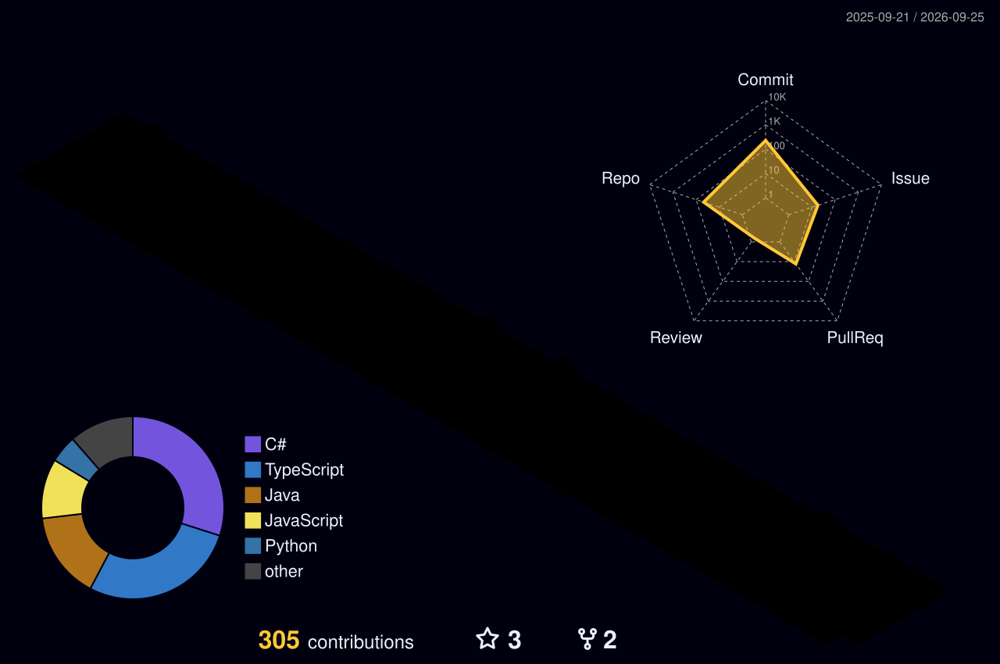

<div align="center">


<a href="https://git.io/typing-svg"></a>

<p>
  <a href="https://github.com/tranvietanh0"></a>
  
  
  
</p>

</div>


## 🎮 PLAYER PROFILE

```csharp
// > whoami --player
public sealed class TranVietAnh : UnityDeveloper
{
    public string   Class    => "Unity Game Developer";
    public string   Server   => "Vietnam 🇻🇳";
    public string[] Genres   => new[] { "Casual", "Hyper-Casual" };
    public string[] Focus    => new[] { "Game Architecture", "Gameplay Systems", "UI Frameworks", "Editor Tooling" };
    public string[] Equipped => new[] { "VContainer", "MessagePipe", "UniTask", "Addressables", "DOTween" };

    public override string Motto => "Build it once, reuse it everywhere.";
}
```

## ⚔️ SKILL TREE

<table>
<tr>
<td width="50%" valign="top">

| Skill | Level |
|---|---|
| 🎲 Unity |  |
| 💜 C# |  |
| 🧱 Game Architecture |  |

</td>
<td width="50%" valign="top">

| Skill | Level |
|---|---|
| 🕹️ Gameplay Systems |  |
| 🖼️ UI Frameworks |  |
| 🛠️ Editor Tooling |  |

</td>
</tr>
</table>

<details>
<summary><b>📜 Passive abilities</b></summary>
<br/>

- **Modular DI** with VContainer: every system plugs in, nothing is hard-wired
- **Signal-driven flow** with MessagePipe: features talk through events, not references
- **State machines** for game and screen flow
- **Async-first** gameplay with UniTask
- **Presenter-based UI** and screen management
- **Addressables** pipelines and editor tools that save hours of content work

</details>

## 🎒 INVENTORY

<div align="center">


<br/><br/>


</div>

## 🗺️ QUEST LOG

<table>
<tr>
<td width="50%" valign="top" align="center">

<a href="https://github.com/tranvietanh0/GameFoundationCore"></a>

**🧩 Main Quest: GameFoundationCore**<br/>
<sub>Shared foundation layer: DI helpers, signal bus, UI module and screen flow</sub><br/>


</td>
<td width="50%" valign="top" align="center">

<a href="https://github.com/tranvietanh0/HyperCasualGameTemplate"></a>

**⚡ Main Quest: HyperCasualGameTemplate**<br/>
<sub>Bootstrap-ready starter: project structure, gameplay flow, local data and state</sub><br/>


</td>
</tr>
<tr>
<td width="50%" valign="top" align="center">

<a href="https://github.com/tranvietanh0/MockupToUnityUI"></a>

**🎨 Side Quest: MockupToUnityUI**<br/>
<sub>From UI mockup to Unity UI, faster</sub><br/>


</td>
<td width="50%" valign="top" align="center">

<a href="https://github.com/tranvietanh0/oh-my-game-kit"></a>

**🧰 Side Quest: oh-my-game-kit**<br/>
<sub>A toolkit for game development workflows</sub><br/>


</td>
</tr>
</table>

## 🏆 ACHIEVEMENTS

<div align="center">




</div>

## 👾 ARCADE

<div align="center">

<picture>
  <source media="(prefers-color-scheme: dark)" srcset="https://raw.githubusercontent.com/tranvietanh0/tranvietanh0/output/pacman-contribution-graph-dark.svg"/>
  <source media="(prefers-color-scheme: light)" srcset="https://raw.githubusercontent.com/tranvietanh0/tranvietanh0/output/pacman-contribution-graph.svg"/>
  
</picture>

<picture>
  <source media="(prefers-color-scheme: dark)" srcset="https://raw.githubusercontent.com/tranvietanh0/tranvietanh0/output/galaga-contribution-graph-dark.svg"/>
  <source media="(prefers-color-scheme: light)" srcset="https://raw.githubusercontent.com/tranvietanh0/tranvietanh0/output/galaga-contribution-graph.svg"/>
  
</picture>

</div>

## 🤝 JOIN MY PARTY

<div align="center">

Open to co-op on **Unity game architecture**, **gameplay programming**, **reusable templates** and **production tooling**.

<a href="https://github.com/tranvietanh0"></a>


</div>
