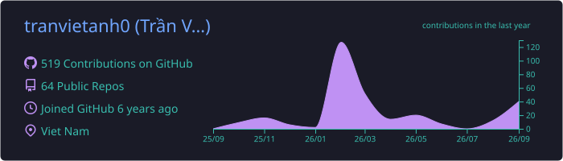
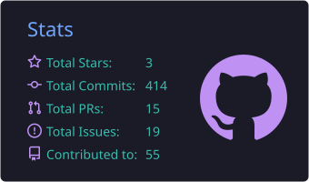
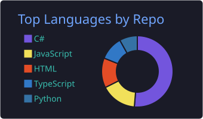
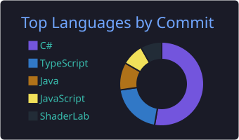

<div align="center">


<a href="https://git.io/typing-svg"></a>

<p>
  <a href="https://github.com/tranvietanh0"></a>
  
  
  
</p>

</div>


## 🎮 `whoami`

```csharp
public sealed class TranVietAnh : UnityDeveloper
{
    public string   Location => "Vietnam 🇻🇳";
    public string[] Focus    => new[] { "Game Architecture", "Gameplay Systems", "UI Frameworks", "Editor Tooling" };
    public string[] Genres   => new[] { "Casual", "Hyper-Casual" };
    public string[] Stack    => new[] { "VContainer", "MessagePipe", "UniTask", "Addressables", "DOTween" };

    public override string Motto => "Build it once, reuse it everywhere.";
}
```

I build Unity projects around **reusable architecture**, **clean gameplay flow** and **production-friendly tooling**: the kind of foundation that lets the next game start on day one instead of day thirty.

<table>
<tr>
<td width="50%" valign="top">

### 🧱 Architecture
- Modular DI composition with **VContainer**
- Signal-driven systems with **MessagePipe**
- State machines for game & screen flow
- Async-first code with **UniTask**

</td>
<td width="50%" valign="top">

### 🕹️ Gameplay & Tools
- Core loops for casual & hyper-casual games
- Presenter-based UI and screen management
- Addressables-driven asset pipelines
- Editor tools that speed up content work

</td>
</tr>
</table>

## 🛠️ Tech Stack

<div align="center">


<br/><br/>


</div>

## 🚀 Featured Projects

<table>
<tr>
<td width="50%" valign="top">

#### 🧩 [GameFoundationCore](https://github.com/tranvietanh0/GameFoundationCore)
Shared foundation layer for Unity projects.
<br/><sub>DI helpers · Signal bus · UI module & screen flow</sub>
<br/><br/>

</td>
<td width="50%" valign="top">

#### ⚡ [HyperCasualGameTemplate](https://github.com/tranvietanh0/HyperCasualGameTemplate)
Bootstrap-ready starter for hyper-casual production.
<br/><sub>Project structure · Gameplay flow · Local data & state</sub>
<br/><br/>

</td>
</tr>
<tr>
<td width="50%" valign="top">

#### 🎨 [MockupToUnityUI](https://github.com/tranvietanh0/MockupToUnityUI)
From UI mockup to Unity UI, faster.
<br/><sub>UI workflow · Editor tooling</sub>
<br/><br/>

</td>
<td width="50%" valign="top">

#### 🧰 [oh-my-game-kit](https://github.com/tranvietanh0/oh-my-game-kit)
A toolkit for game development workflows.
<br/><sub>Tooling · Automation</sub>
<br/><br/>

</td>
</tr>
</table>

## 📊 GitHub Stats

<div align="center">









<br/><br/>

<picture>
  <source media="(prefers-color-scheme: dark)" srcset="https://raw.githubusercontent.com/tranvietanh0/tranvietanh0/output/github-snake-dark.svg"/>
  <source media="(prefers-color-scheme: light)" srcset="https://raw.githubusercontent.com/tranvietanh0/tranvietanh0/output/github-snake.svg"/>
  
</picture>

</div>

## 🤝 Let's Connect

<div align="center">

Open to collaboration on **Unity game architecture**, **gameplay programming**, **reusable templates** and **production tooling**.

<a href="https://github.com/tranvietanh0"></a>


</div>
